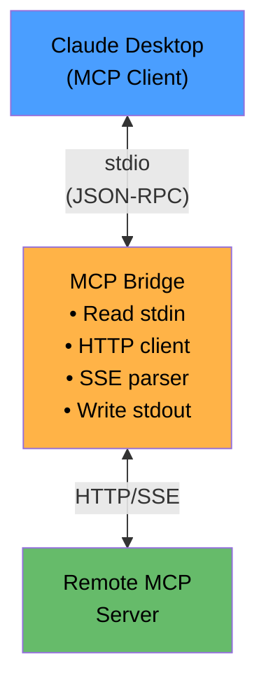

# MCP Bridge

Universal transport bridge for Model Context Protocol (MCP) - connect stdio-based MCP clients to remote servers over HTTP/SSE.

## What is MCP Bridge?

MCP Bridge solves a common integration challenge: **MCP clients like Claude Desktop expect stdio connections, but many MCP servers run remotely over HTTP/SSE**. This bridge sits in the middle, translating between these protocols seamlessly.


### Use Cases

- Connect Claude Desktop to remote/containerized MCP servers
- Access cloud-hosted MCP services from local clients
- Bridge to MCP servers behind authentication
- Enable any stdio-based MCP client to use HTTP/SSE servers

## Installation

### Using pip (recommended)

```bash
pip install mcp-bridge
```

### Using uv

```bash
pip install uv
uv pip install mcp-bridge
```

### From source

```bash
git clone https://github.com/geosp/mcp-bridge.git
cd mcp-bridge
uv pip install -e .
```

After installation, verify it's working:

```bash
mcp-bridge --version
```

## Quick Start

### 1. Initialize Configuration

Create your first config file:

```bash
mcp-bridge init
```

This creates `~/.config/mcp-bridge/config.json` with an example configuration.

### 2. Edit Configuration

Edit the config file with your server details:

```bash
# macOS/Linux
vi ~/.config/mcp-bridge/config.json

# Or use your preferred editor
code ~/.config/mcp-bridge/config.json
```

Configuration format:

```json
{
  "url": "http://your-mcp-server.example.com/mcp-endpoint",
  "headers": {
    "Authorization": "Bearer your-token-here"
  }
}
```

**Configuration Options:**
- `url` (required): The HTTP/SSE endpoint of your remote MCP server
- `headers` (optional): HTTP headers to include with requests (e.g., authentication tokens)

### 3. Test the Bridge

Test your configuration with a simple initialize request:

```bash
echo '{"jsonrpc":"2.0","id":1,"method":"initialize","params":{"protocolVersion":"2024-11-05","capabilities":{},"clientInfo":{"name":"test","version":"1.0"}}}' | mcp-bridge
```

You should see a JSON response from your server.

## Multi-Server Configuration

You can configure multiple servers with named configs:

```bash
# Create configs for different servers
mcp-bridge init --name weather
mcp-bridge init --name database
mcp-bridge init --name analytics

# List all configs
mcp-bridge list-configs

# Use a specific config
mcp-bridge --config weather.json
```

## Usage with Claude Desktop

### Single Server Setup

1. First, create and configure your bridge config:

```bash
mcp-bridge init
# Edit ~/.config/mcp-bridge/config.json with your server details
```

2. Add this to your Claude Desktop configuration file:

**macOS**: `~/Library/Application Support/Claude/claude_desktop_config.json`
**Windows**: `%APPDATA%/Claude/claude_desktop_config.json`

```json
{
  "mcpServers": {
    "remote-server": {
      "command": "mcp-bridge",
      "args": []
    }
  }
}
```

3. Restart Claude Desktop

### Multiple Servers Setup

For multiple remote servers:

1. Create named configs for each server:

```bash
mcp-bridge init --name weather
mcp-bridge init --name database
# Edit each config file with appropriate server details
```

2. Update Claude Desktop config:

```json
{
  "mcpServers": {
    "weather-server": {
      "command": "mcp-bridge",
      "args": ["--config", "weather.json"]
    },
    "database-server": {
      "command": "mcp-bridge",
      "args": ["--config", "database.json"]
    }
  }
}
```

3. Restart Claude Desktop

Each bridge instance will connect to its configured remote server independently.

## How It Works

1. **Stdio Interface**: Listens for JSON-RPC messages from Claude Desktop on stdin
2. **HTTP Translation**: Forwards requests to the remote MCP server via HTTP POST
3. **SSE Streaming**: Reads Server-Sent Events responses from the HTTP connection
4. **Session Management**: Maintains session IDs across requests
5. **Response Forwarding**: Writes responses back to stdout for the client

## Known Issues & Workarounds

### Claude Desktop Parameter Serialization Bug

**Issue**: Claude Desktop incorrectly serializes complex object parameters when calling MCP tools. Object and array parameters are converted to JSON strings instead of being preserved as objects in the JSON-RPC payload sent to MCP servers.

**Example of the bug**:
```json
// Expected by MCP servers:
{"arguments": {"filter": {"lastName": "Fajardo"}}}

// Actual from Claude Desktop:
{"arguments": {"filter": "{\"lastName\": \"Fajardo\"}"}}
```

**Impact**:
- MCP servers reject these calls with "Input validation error"
- Any MCP tool with object or array parameters fails to work correctly
- Affects tools like database filters, complex configurations, nested data structures

**MCP Bridge Workaround**:
This bridge **automatically detects and fixes** stringified parameters before forwarding requests to your MCP server. The workaround:

1. Detects when parameter values are JSON strings instead of objects/arrays
2. Safely deserializes them back to the correct type
3. Forwards the corrected parameters to your MCP server
4. Logs when corrections are made (visible in stderr logs)

**What this means for you**:
- ✅ Your MCP tools with object/array parameters will work correctly
- ✅ No changes needed to your MCP server code
- ✅ Automatic and transparent - no configuration required
- ✅ Safe - invalid JSON strings are preserved as-is

**Example log output**:
```
[Bridge] Fixed stringified params: filter:dict, tags:list
[Bridge] Sending: tools/call (id=123)
```

**Status**:
- ✅ Workaround implemented and tested (as of v0.2.0)
- ✅ Confirmed working with Claude Desktop's stringified parameters
- Bug exists in Claude Desktop (report pending to Anthropic)
- This workaround is temporary until Claude Desktop is fixed
- The workaround is safe and will not cause issues once the bug is resolved

**Technical details**: The deserialization logic is in [`bridge.py:16-63`](src/mcp_bridge/bridge.py) and is applied in the `send_message()` method before forwarding requests to the HTTP server.

## Architecture



## Example Configurations

See the `examples/` directory for sample configurations:

- `examples/local-server.json` - Connect to a local MCP server
- `examples/authenticated-server.json` - Server with bearer token auth
- `examples/claude-desktop-config.json` - Claude Desktop configuration

## Troubleshooting

### Bridge not connecting

- Check that `config.json` exists and has valid JSON
- Verify the `url` is accessible from your machine
- Check logs in stderr for error messages

### Authentication failures

- Ensure your `Authorization` header token is valid
- Check if the token has expired
- Verify the token format matches server expectations

### Claude Desktop not finding the bridge

- Verify `mcp-bridge` is in your PATH: `which mcp-bridge`
- If using a virtual environment, use the full path:
  ```json
  {
    "mcpServers": {
      "remote-server": {
        "command": "/full/path/to/mcp-bridge",
        "args": []
      }
    }
  }
  ```
- Check Claude Desktop logs for error messages

### Config file not found

```bash
# Check what configs exist
mcp-bridge list-configs

# Create a new config if needed
mcp-bridge init
```

### Enable debug logging

The bridge logs to stderr. Claude Desktop captures these logs. You can also test manually:

```bash
echo '{"jsonrpc":"2.0","id":1,"method":"initialize","params":{}}' | mcp-bridge 2> bridge.log
```

## CLI Commands

```bash
# Show version
mcp-bridge --version

# Initialize a new config
mcp-bridge init
mcp-bridge init --name myserver

# List all configs
mcp-bridge list-configs

# Run with default config
mcp-bridge

# Run with specific config
mcp-bridge --config weather.json
```

## Future Enhancements

- [ ] WebSocket transport support
- [x] Multiple server configurations (completed in v0.2.0)
- [ ] Request/response logging options
- [ ] Retry logic and connection pooling
- [ ] Health check endpoints
- [ ] TLS/SSL certificate configuration

## Contributing

Contributions are welcome! Please see [CONTRIBUTING.md](CONTRIBUTING.md) for guidelines.

## License

MIT License - see [LICENSE](LICENSE) file for details.

## Related Projects

- [Model Context Protocol](https://modelcontextprotocol.io/) - Official MCP documentation
- [Claude Desktop](https://claude.ai/download) - Anthropic's desktop client

## Support

- **Issues**: [GitHub Issues](https://github.com/yourusername/mcp-bridge/issues)
- **Discussions**: [GitHub Discussions](https://github.com/yourusername/mcp-bridge/discussions)
- **Documentation**: [docs.claude.com](https://docs.claude.com)
